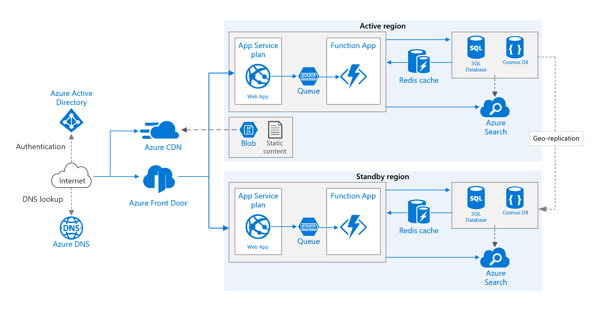

# Azure Cloud Documentation
## Getting Started
A series of Bash scripts are provided to perform Infrastructure related tasks.

### Installation
Multiple options exist to use the Azure CLI for working with FAST Infrastructure.

Begin by [installing](https://docs.microsoft.com/en-us/cli/azure/install-azure-cli?view=azure-cli-latest) a preferred Azure CLI.

Sign in happens interactively with Azure CLI upon executing `bash login.sh`. Leverages the security groups within the Azure tenent by launching the user into a web browser for authentication.

```bash
bash login.sh
```

When using Bash scripts it's not necessary to manually login and perform CLI commands. The scripts will collect and perform the complete operations.

However, some may find it useful to perform other management and lookup tasks using the Azure CLI as it's fast and efficient.

### Configuration
Configuration occurs automatically upon first executing `bash login.sh` and is stored in the user's home directory.

* On Linux or MacOS it's stored at `$HOME/.azure`. To view execute `cat ~/.azure/config` on your CLI. 
* On Windows it's stored at `%USERPROFILE%\.azure`.

For additional details on [Azure CLI Configuration](https://docs.microsoft.com/en-us/cli/azure/azure-cli-configuration?view=azure-cli-latest).

### Execution Commands
Bash scripts are available to perform all Infrastructure actions and are ordered based on the necessary procedures to build out new infrastructure. Assuming the user has an Azure Subscription, anyone can quickly and easily onboard to Azure using these scripts. Assuming they have the proper permissions to read/write/execute in the Azure Cloud.

1. Create an Azure App Service: Automates setting up a web application.

```bash
bash create-app-service.sh
```

2. Delete an Azure App Service: Automates tearing down a web application.

```bash
bash delete-app-service.sh
```

### Deletion
Configuration management requires frequent build up and tear down procedures against Azure Cloud resources. This will safely delete the entire resource group and all resources that reside within.  

This is an intentionally manual process that uses the interactive shell for added protection and safety from harming the Infrastructure.

```bash
az group delete --name "some-resource-group-name"
```

## Architecture
FAST uses Azure Cloud Infrasture and Platform as a Service for highly available multi-regional web applications as shown next.  Details are available on [Azure](https://docs.microsoft.com/en-us/azure/architecture/reference-architectures/app-service-web-app/multi-region).



### Requirements
* Availability
* Data Privacy & Security
* Management and Monitoring
* Performance and Scalability
* Resiliency

### Naming Standards
Follow all naming standards from https://docs.microsoft.com/en-us/azure/cloud-adoption-framework/ready/azure-best-practices/naming-and-tagging with the one exception, suffics instead of prefix. For example `rg-` is the recommendation. However, choose `-rg` instead to allow for product / area groupings considering that the Azure Portal already has a column for Resource Type.

### Management Groups & Subscriptions
This hierarchy uses the Workload separation strategy:

#### Management Groups
* Design
  * Fast Design
 
    * Fast Production (Primary Region - West US)
      * Production Subscription
        * App Service Plan (single unit)
          * Web Apps
        * Data Storage
        * CDN
 
    * Fast Staging (Secondary Region - East US)
      * Staging Subscription
        * App Service Plan (single unit)
    
    * Fast Development
      * Internal
      * External
  
  * Edge Design Mg
    * Edge Internal
    * Edge External
      * Primary Region
      * Secondary Region

#### Subscriptions
* Internal - Edge Design
* Internal - Fast Design


### Front Door
Front Door is a modern Content Delivery Network (CDN) and so along with dynamic site acceleration and load balancing, it also supports caching behaviors just like any other CDN. [learn more](https://docs.microsoft.com/en-us/azure/frontdoor/front-door-caching)


#### TODO
1. https://docs.microsoft.com/en-us/azure/frontdoor/quickstart-create-front-door#create-a-front-door-for-your-application


### Building for Resiliency
https://docs.microsoft.com/en-us/azure/architecture/framework/resiliency/overview

